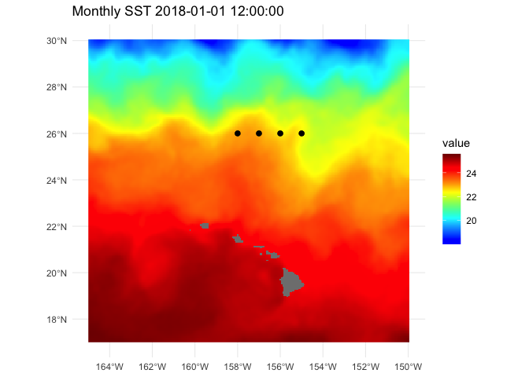
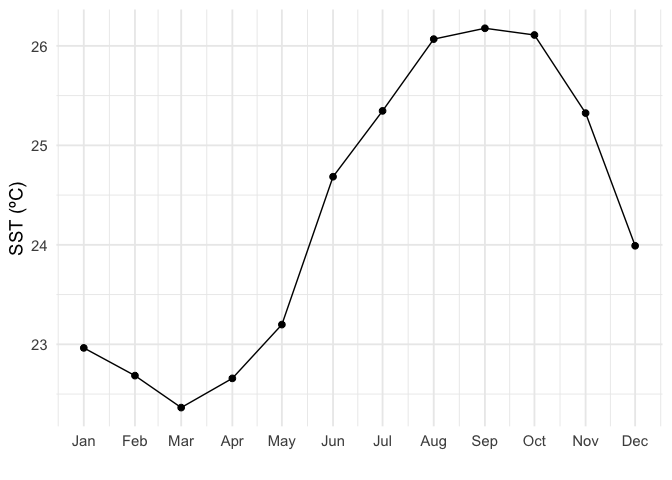
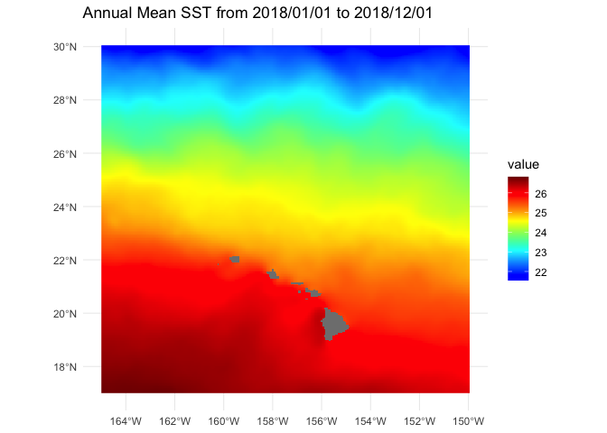

This tutorial will show the steps to grab data in ERDDAP from R, how to
work with NetCDF files in R and how to make some maps and time-series of
sea surface temperature (SST) around the main Hawaiian islands.

If you do not have the ncdf4 and httr packages installed in R, you will
need to install them. For later use, we willll also use the sf, ggplot2,
terra, and tidyterra packages. The following code checks to see if the
packages are installed or not, and will install them if needed:

``` r
# Package names
packages <- c( "ncdf4","httr", "terra", "tidyterra", "ggplot2", "sf")

# Install packages not yet installed
installed_packages <- packages %in% rownames(installed.packages())

if (any(installed_packages == FALSE)) {
  install.packages(packages[!installed_packages])
}

# Load packages 
invisible(lapply(packages, library, character.only = TRUE))
```

    ## terra 1.7.5

    ## 
    ## Attaching package: 'tidyterra'

    ## The following object is masked from 'package:stats':
    ## 
    ##     filter

    ## Linking to GEOS 3.11.0, GDAL 3.5.3, PROJ 9.1.0; sf_use_s2() is TRUE

If you are having problems with terra loading netcdf files later in the
script, try installing it from source from its github repo or from CRAN.

``` r
remotes::install_github("rspatial/terra")
```

\##Downloading data in R

Because ERDDAP includes RESTful services, you can download data listed
on any ERDDAP platform from R using the URL structure.

For example, the following page allows you to subset monthly SST data:
<https://oceanwatch.pifsc.noaa.gov/erddap/griddap/CRW_sst_v1_0_monthly.html>

Select your region and date range of interest, then select the ‘.nc’
(NetCDF) file type and click on “Just Generate the URL”.


In this specific example, the URL we generated is :

<https://oceanwatch.pifsc.noaa.gov/erddap/griddap/CRW_sst_v1_0_monthly.nc?analysed_sst>\[(2018-01-01T12:00:00Z):1:(2018-12-01T12:00:00Z)\]\[(17):1:(30)\]\[(195):1:(210)\]

You can also edit this URL manually.

In R, run the following to download the data using the generated URL
(you need to copy it from your browser):

``` r
junk <- GET('https://oceanwatch.pifsc.noaa.gov/erddap/griddap/CRW_sst_v1_0_monthly.nc?analysed_sst[(2018-01-01T12:00:00Z):1:(2018-12-01T12:00:00Z)][(17):1:(30)][(195):1:(210)]', 
            write_disk("sst.nc", 
                       overwrite=TRUE))
```

\##Importing the downloaded data in R

Now that we have downloaded the data locally, we can import it and
extract our variables of interest:

- open the file

``` r
sst <- rast('sst.nc')
```

- examine which variables are included in the dataset:

``` r
varnames(sst)
```

    ## [1] "analysed_sst"

To learn more about the dataset

``` r
sst
```

    ## class       : SpatRaster 
    ## dimensions  : 261, 301, 12  (nrow, ncol, nlyr)
    ## resolution  : 0.05, 0.05  (x, y)
    ## extent      : 195, 210.05, 17, 30.05  (xmin, xmax, ymin, ymax)
    ## coord. ref. : lon/lat WGS 84 
    ## source      : sst.nc 
    ## varname     : analysed_sst (analysed sea surface temperature) 
    ## names       : analy~sst_1, analy~sst_2, analy~sst_3, analy~sst_4, analy~sst_5, analy~sst_6, ... 
    ## unit        :    degree_C,    degree_C,    degree_C,    degree_C,    degree_C,    degree_C, ... 
    ## time        : 2018-01-01 12:00:00 to 2018-12-01 12:00:00 UTC

``` r
# in this case, each layer has the same metadata
metadata(sst)[[1]]
```

    ##       [,1]                    [,2]                              
    ##  [1,] "colorBarMaximum"       "32"                              
    ##  [2,] "colorBarMinimum"       "0"                               
    ##  [3,] "coverage_content_type" "physicalMeasurement"             
    ##  [4,] "grid_mapping"          "crs"                             
    ##  [5,] "ioos_category"         "Temperature"                     
    ##  [6,] "long_name"             "analysed sea surface temperature"
    ##  [7,] "NETCDF_DIM_time"       "1514808000"                      
    ##  [8,] "NETCDF_VARNAME"        "analysed_sst"                    
    ##  [9,] "standard_name"         "sea_surface_temperature"         
    ## [10,] "units"                 "degree_C"                        
    ## [11,] "valid_max"             "5000"                            
    ## [12,] "valid_min"             "-200"                            
    ## [13,] "_FillValue"            "nan"

The later you might want to just look at the first element of, but they
are all the same.

- examine the array structure of sst:

``` r
dim(sst)
```

    ## [1] 261 301  12

Our dataset is a 3-D array with 301 columns corresponding to longitudes,
261 rows corresponding to latitudes for each of the 12 time steps.

- get the dates for each time step:

``` r
dates <- time(sst)
```

## Working with the extracted data

### Creating a map for one time step

Let us create a map of SST for January 2018 (our first time step). You
will need to download the
[scale.R](https://oceanwatch.pifsc.noaa.gov/files/scale.R) file and copy
it to your working directory to plot the color scale properly.

- set some color breaks

``` r
h <- hist(values(sst), 100, plot=FALSE)
breaks <- h$breaks
n <- length(breaks)-1
```

- define a color palette

``` r
jet.colors <- colorRampPalette(c("blue", "#007FFF", "cyan","#7FFF7F", "yellow", "#FF7F00", "red", "#7F0000"))
```

- set color scale using the jet.colors palette

``` r
cols <- jet.colors(n)
```

``` r
sst_1 <- sst[[1]]

sst_map <- ggplot() +
    geom_spatraster(data = sst_1) +
    scale_fill_gradientn(colors = cols) +
    labs(title = paste0("Monthly SST ", dates[1])) +
    theme_minimal()

sst_map
```

<!-- -->

``` r
#example of how to add points to the map
pts_sf <- data.frame(lat = 26, lon = 202:205) |>
    st_as_sf(coords = c("lon", "lat"),
             crs = st_crs(sst_1))

sst_map +
    geom_sf(data = pts_sf, size = 2)
```

<!-- -->

``` r
# example of how to add a contour 
# note, for terra, you need to ask it to set a min and max
sst_1 <- sst_1 |>
    setMinMax()

# from data
sst_map +
    geom_spatraster_contour(data = sst_1) 
```

<!-- -->

``` r
# your choice of 20
sst_map +
    geom_spatraster_contour(data = sst_1,
                            breaks = c(0,20),
                            linewidth = 1) 
```

<!-- -->

### Plotting a time series

Let us pick the following box : 24-26N, 200-206E. We are going to
generate a time series of mean SST within that box.

``` r
# first, crop  24-26N, 200-206E
sst_cropped <- crop(sst, 
                    ext(200, 206, 24, 26))

sst_monthly_means <- global(sst_cropped, mean) |>
    mutate(date = time(sst_cropped))
           
ggplot(sst_monthly_means,
       aes(x = as.Date(date), y = mean)) +
    geom_line() + 
    geom_point(size = 2) +
    scale_x_date(date_breaks = "1 month",
                 date_labels = "%b") +
    labs(x = "", y = "SST (ºC)") +
    theme_minimal(base_size = 14)
```

<!-- -->

### Creating a map of average SST over a year

``` r
# app calculates cell-wise across a raster stack here
sst_means <- app(sst, mean)

ggplot() +
    geom_spatraster(data = sst_means) +
    scale_fill_gradientn(colors = cols) +
    labs(title = paste0("Annual Mean SST from ",
                       format(dates[1],'%Y/%m/%d'), 
                        " to ",
                        format(dates[12],'%Y/%m/%d'))) +
    theme_minimal()
```

<!-- -->
