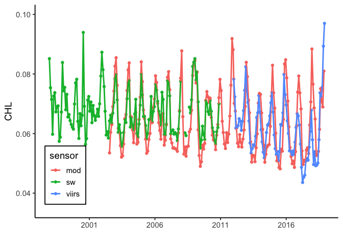
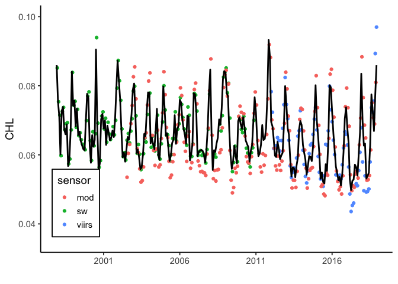

This tutorial will showcase the use of the rerddap package, which was
developed to make it easier to interact with ERDDAP servers from R.

More information about the package can be found here:
[https://cran.r-project.org/web/packages/rerddap/index.html](%5Bhttps://cran.r-project.org/web/packages/rerddap/index.html)

and here:
<https://cran.r-project.org/web/packages/rerddap/vignettes/Using_rerddap.html>

As an example, we are going to plot time-series of mean chlorophyll a
concentration from various sensors from 1997 to 2018 to look at the
periods of overlap.

We are going to download data from Seawifs (1997-2010), MODIS
(2002-present) and VIIRS (2012-present) and compare it to the ESA-CCI
data which combines all 3 sensors into a homogeneous time-series.

- Load packages:

``` r
packages <- c( "ncdf4","dplyr","lubridate","rerddap", "ggplot2")

# Install packages not yet installed
installed_packages <- packages %in% rownames(installed.packages())

if (any(installed_packages == FALSE)) {
  install.packages(packages[!installed_packages])
}

# Load packages 
invisible(lapply(packages, library, character.only = TRUE))
```

First we define the longitude-latitude boundaries of the box:

``` r
xcoord <- c(198,208)
ycoord <- c(15,25)
```

Next we define the URL of the ERDDAP we will be using:

``` r
ERDDAP_Node <- "https://oceanwatch.pifsc.noaa.gov/erddap/"
```

### Get monthly seawifs data, which starts in 1997.

Go to ERDDAP to find the name of the dataset for monthly SeaWIFS data:
sw_chla_monthly_2018_0

You should always examine the dataset in ERDDAP to check the date range,
names of the variables and dataset ID, to make sure your griddap calls
are correct:
<https://oceanwatch.pifsc.noaa.gov/erddap/griddap/sw_chla_monthly_2018_0.html>

First we need to know what our variable is called:

``` r
dataInfo <- rerddap::info('sw_chla_monthly_2018_0',
                          url=ERDDAP_Node)

var <- dataInfo$variable$variable_name

var
```

    ## [1] "chlor_a"

We are interested in the chlor_a variable, which contains the values of
chlorophyll-a concentration. This is var\[1\].

griddap is a function from the rerddap package. It grabs the data from
ERDDAP based on the parameters we give it.

We are grabbing a lot of data so all the griddap commands might take a
while.

``` r
sw <- griddap(url=ERDDAP_Node, 
              datasetx = 'sw_chla_monthly_2018_0', 
              time = c('1997-12-01', '2010-12-01'), 
              latitude = ycoord, longitude = xcoord, 
              fields = var[1] )

#Spatially average all the data within the box

swAVG <- sw$data |>
  group_by(time) |>
  summarize(V1 = mean(chlor_a, na.rm = TRUE),
            sensor = "sw")
```

### Get monthly MODIS data, which starts in 2002.

``` r
## MODIS from from https://oceanwatch.pifsc.noaa.gov/erddap/griddap/aqua_chla_monthly_2018_0

dataInfoMOD <- rerddap::info('aqua_chla_monthly_2018_0',
                          url=ERDDAP_Node)

varMOD <- dataInfoMOD$variable$variable_name

# get the data
MOD <- griddap(url=ERDDAP_Node, 
               'aqua_chla_monthly_2018_0', 
               time = c('2002-07-16', '2018-12-16'), 
               latitude = ycoord, longitude = xcoord, 
               fields = varMOD[1])


#Spatially average all the data within the box:

MODAVG <- MOD$data |>
  group_by(time) |>
  summarize(V1 = mean(chlor_a, na.rm = TRUE),
            sensor = "mod")
```

### Get monthly VIIRS data, which starts in 2012.

``` r
## VIIRS from https://oceanwatch.pifsc.noaa.gov/erddap/griddap/noaa_snpp_chla_monthly.html

dataInfoVIIRS <- rerddap::info('noaa_snpp_chla_monthly',
                               url=ERDDAP_Node)

varVIIRS <- dataInfoVIIRS$variable$variable_name

VIIRS <- griddap(url=ERDDAP_Node, 
                 datasetx = 'noaa_snpp_chla_monthly', 
                 time = c('2012-01-02', '2018-12-01'), 
                 latitude = ycoord, longitude = xcoord, 
                 fields = varVIIRS)

#Spatially average all the data within the box:

VIIRSAVG <- VIIRS$data |>
  group_by(time) |>
  summarize(V1 = mean(chlor_a, na.rm = TRUE),
            sensor = "viirs") 
```

### Get OC-CCI data (September 1997 to Dec 2018)

``` r
dataInfoCCI <- rerddap::info('esa-cci-chla-monthly-v4-2', 
                             url=ERDDAP_Node)

varCCI <- dataInfoCCI$variable$variable_name

CCI <- griddap(url=ERDDAP_Node, 'esa-cci-chla-monthly-v4-2', 
               time = c('1997-09-04', '2018-12-01'), 
               latitude = ycoord, longitude = xcoord, 
               fields = varCCI[1] )

#Spatially average all the data within the box:

CCIAVG <- CCI$data |>
  group_by(time) |>
  summarize(V1 = mean(chlor_a, na.rm = TRUE),
            sensor = "cci") |>
  mutate(time = as.Date(time))  # we will need this later
```

We can then make a unified dataset from the sensors, making sure time is
a date object:

``` r
# Make a unified dataset
chlor_a_dat <- bind_rows(swAVG, VIIRSAVG, MODAVG) |>
  mutate(time = as.Date(time))
```

Note, as the workflow to get each averaged dataset was the same, we
leave it to the reader to turn the workflow into a function and then use
`purrr::map_df()` to make the same dataset with less repeated code. This
also has the advantage that the grids can be discared swiftly.

### Plot time series result

Now plot this, using some settings to put the legend in a nice place.

``` r
base_sensor_plot <- ggplot(chlor_a_dat,
       aes(x = time, y = V1, 
           color = sensor)) +
  geom_point() +
  labs(x = "", y = "CHL") +
  scale_x_date(date_breaks = "5 years",
               date_labels = "%Y",
               limits = as.Date(c("1997-12-01","2018-12-01"))) +
  ylim(c(0.035,0.10))+
  theme_classic(base_size = 14) +
  theme(legend.position = c(0.1, 0.2),
        legend.background = element_rect(color = "black"))

base_sensor_plot + geom_line(size = 1)
```

<!-- -->

You can see that the values of chl-a concentration don’t match between
sensors.

### Make another plot with CCI as well to compare

``` r
base_sensor_plot +
    geom_line(data = CCIAVG, 
              color = "black",
              size = 1) #the CCI overlay
```

<!-- -->
