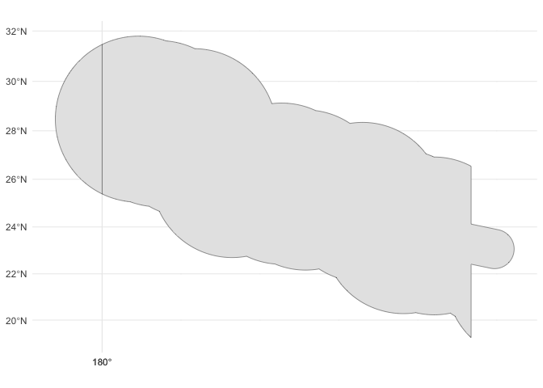
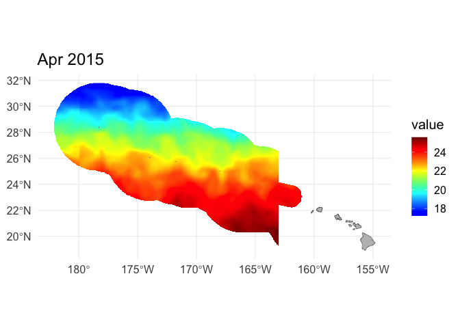

This tutorial uses the Xtractomatic package to download data from within
the boundaries of the Papahanaumokuakea Marine National Monument (PMNM).

This script uses the rerddap version of Xtractomatic: rerddapXtracto.
More information is available here:
<https://coastwatch.pfeg.noaa.gov/xtracto/> and here:
<https://cran.r-project.org/web/packages/rerddapXtracto/>

This tutorial will teach you how to extract and display SST values for a
particular time period or average SST over the whole time-series
available within a shapefile.

The shapefile for the PMNM boundaries can be downloaded here:
<http://sanctuaries.noaa.gov/library/imast_gis.html>

### Extract the monument boundaries from the downloaded shapefile.

Save the file <https://sanctuaries.noaa.gov/library/imast/pmnm_py.zip>
on your computer and extract it. Navigate to the PMNM_py_files folder.

If you don’t have the sf package installed on your computer, you will
need to install it.

``` r
packages <- c( "sf","rerddap", "rerddapXtracto",
               "rnaturalearth", "rnaturalearthhires",
               "terra", "tidyterra", "ggplot2", "dplyr")

# Install packages not yet installed
installed_packages <- packages %in% rownames(installed.packages())

if (any(installed_packages == FALSE)) {
  install.packages(packages[!installed_packages])
}

# Load packages 
invisible(lapply(packages, library, character.only = TRUE))
```

Load in the boundaries of the sanctuary from the file downloaded
previously

``` r
test <- st_read('PMNM_py_files/PMNM_py.shp')
```

    ## Reading layer `PMNM_py' from data source 
    ##   `/Users/jebyrnes/Downloads/noaa_coastwatch_tutorial_1/PMNM_py_files/PMNM_py.shp' 
    ##   using driver `ESRI Shapefile'
    ## Simple feature collection with 1 feature and 2 fields
    ## Geometry type: MULTIPOLYGON
    ## Dimension:     XY
    ## Bounding box:  xmin: -180 ymin: 19.23458 xmax: 180 ymax: 31.79786
    ## Geodetic CRS:  NAD83

We need to convert the coordinate system to 0 to 360 degrees.

``` r
PNMN <- test |>
  st_shift_longitude()
```

We can see that things have worked using `ggplot2` with the Pacific
projection (EPSG:3832).

``` r
ggplot() +
  geom_sf(data = PNMN) +
  coord_sf(crs = 3832) +
  theme_minimal()
```

<!-- -->

### Data extraction

The example below extracts monthly 5km geopolar blended SST (Links to an
external site.) data within the monument boundary. The time variable
passed to xtractogon must be two elements, the start and endpoints of
the desired time period.

``` r
ERDDAP_Node <- 
    "https://oceanwatch.pifsc.noaa.gov/erddap/"

dataInfo <- rerddap::info(
  'goes-poes-monthly-ghrsst-RAN', 
   url=ERDDAP_Node)
```

Let’s look at the variables in our dataset:

``` r
dataInfo$variable$variable_name
```

    ## [1] "analysed_sst"     "sea_ice_fraction"

We are interested in sea surface temperature data, so we need to select
the first variable: analysed_sst

``` r
parameter <- dataInfo$variable$variable_name[1]

xcoord <- st_coordinates(PNMN)[,1]
ycoord <- st_coordinates(PNMN)[,2]
```

Let’s download data for a few months:

``` r
tcoord <- c("2015-03-15", "2015-11-16")
```

Let’s extract the data within our polygon. Note! The rxtractogon
function will not work for regions across the dateline (like PNMN…) and
datasets with longitudes between -180 and 180º. For regions that cross
the dateline, you need to find a dataset on ERDDAP with longitudes
between 0 and 360º.

This command can take a while to run:

``` r
sst <- rxtractogon (dataInfo, 
                    parameter=parameter, 
                    xcoord=xcoord, 
                    ycoord=ycoord, 
                    tcoord=tcoord)
```

### Plotting the data

The extracted data contains several time steps (months) of sst data in
the monument boundaries. Let’s make a plot of the second time step for
example:

``` r
i <- 2
```

We need to transform our extracted SST data for that time step into a
`SpatRaster` object in `terra` for the image function to work properly.
We can do this using the internal matrix of the data, but, we have to
rotate the raster as rasters deal with rows and columns differently.

``` r
r <- rast(sst$analysed_sst)|> 
  t() |> 
  flip()
```

This SST dataset is also in Kelvin degrees, so let’s convert it to
Celsius degree:

``` r
r <- r - 273.15
```

To make sure that the coordinates are there, we need to add an extent to
our object that is the same as the shapefile we started with.

``` r
set.ext(r, st_bbox(PNMN))
```

We then want to add the time info to the raster and make sure it has a
minimum and maximum value for use by plotting functions:

``` r
time(r) <- sst$time
names(r) <- paste(parameter, 1:dim(r)[3], sep = "_")
#minmax(r)
```

Last, let’s set the CRS again using our shapefile

``` r
crs(r) <- st_crs(PNMN)$proj4string
```

Let’s set the bounds of our region:

``` r
xlim <- c(177,207)
ylim <- c(18,32)
```

Let’s define a custom color scale:

``` r
jet.colors <-colorRampPalette(c("blue", "#007FFF", "cyan","#7FFF7F", "yellow", "#FF7F00", "red", "#7F0000"))
h <- hist(values(r), 50, plot=FALSE)
breaks <- h$breaks
n <- length(breaks)-1
cols <- jet.colors(n)
```

Let’s get a basemap to overlay on the plot.

``` r
land <- rnaturalearth::ne_states(
  country = "united states of america", 
  returnclass = "sf") |>
  dplyr::filter(name == "Hawaii") |>
  st_shift_longitude()
```

Finally, we can bring it all together with `ggplot2` and `tidyterra`:

``` r
ggplot() +
  geom_spatraster(data = r[[i]]) +
  scale_fill_gradientn(colors = cols, na.value = NA) +
  geom_sf(data = land, fill = "grey") +
  theme_minimal(base_size = 15) +
  labs(title = format(time(r)[[i]],'%b %Y'))
```

<!-- -->

### On your own!

Plot the average SST for the period we downloaded:

Hint: here is how to compute the average SST

``` r
mean_sst <- app(r, mean)
```

Now use mean_sst to plot instead of r.
